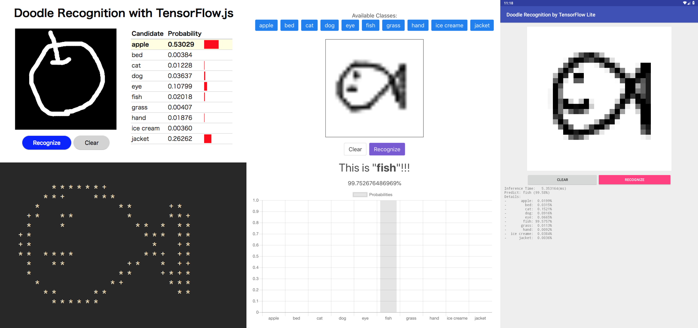

# Doodle Image Recognition by MaruLabo

It is a classification model of 'doodle' image. Classify from 28 pixel square grayscale images.
The learning data uses "[The Quick, Draw! Dataset](https://github.com/googlecreativelab/quickdraw-dataset)".

The model binaries are included in the release.

There is the program source code in `src/doodle` directory.

- `model.py`: The model definition.
- `inputs.py`: Dataset preprocess definition.
- `metrics.py`: Metrics calculations.

## About Datasets

Data is not included in this repository.
The data setup program downloads "The Quick, Draw! Dataset".

It data made available by Google, Inc.
under the Creative Commons Attribution 4.0 International license.
https://creativecommons.org/licenses/by/4.0/

## Examples



### for Web

- `examples/tensorflow_js_simple`: TensorFlow.js + PWA
- `examples/tensorflow_js`: TensorFlow.js + Vue.js

### for Raspberry Pi

- `examples/tensorflow_lite_rpi`: TensorFlow Lite (C++)

### for Android

- `examples/tensorflow_lite_android`: TensorFlow Lite (Java)

## How to use

Install dependency packages:

```
$ pip install -r requirements.txt
```

Training on local machne:

```
$ python ./tools/train_local.py -c ./config.yaml
```

You will get results such as:

```
###### metrics #################################################################
global_step                   : 2000
loss                          : 0.402699053288
macro_average/accuracy        : 0.973749995232
macro_average/f_measure       : 0.870679736137
macro_average/precision       : 0.875779151917
macro_average/recall          : 0.880717754364
macro_class_0/accuracy        : 0.994791686535
macro_class_0/f_measure       : 0.968742370605
macro_class_0/precision       : 0.956623375416
macro_class_0/recall          : 0.985714316368
macro_class_1/accuracy        : 0.981249988079
macro_class_1/f_measure       : 0.870249092579
macro_class_1/precision       : 0.824982345104
macro_class_1/recall          : 0.930000007153
macro_class_2/accuracy        : 0.951041579247
macro_class_2/f_measure       : 0.762770295143
macro_class_2/precision       : 0.769061267376
macro_class_2/recall          : 0.773762583733
macro_class_3/accuracy        : 0.914583384991
macro_class_3/f_measure       : 0.667931675911
macro_class_3/precision       : 0.730173766613
macro_class_3/recall          : 0.627005696297
macro_class_4/accuracy        : 0.981250107288
macro_class_4/f_measure       : 0.876377105713
macro_class_4/precision       : 0.921818137169
macro_class_4/recall          : 0.857774138451
macro_class_5/accuracy        : 0.978124976158
macro_class_5/f_measure       : 0.913400948048
macro_class_5/precision       : 0.870901882648
macro_class_5/recall          : 0.9650349617
macro_class_6/accuracy        : 0.978124916553
macro_class_6/f_measure       : 0.885983645916
macro_class_6/precision       : 0.92440110445
macro_class_6/recall          : 0.864556491375
macro_class_7/accuracy        : 0.981249928474
macro_class_7/f_measure       : 0.897269070148
macro_class_7/precision       : 0.904123425484
macro_class_7/recall          : 0.909956753254
macro_class_8/accuracy        : 0.993749976158
macro_class_8/f_measure       : 0.958296000957
macro_class_8/precision       : 0.966666579247
macro_class_8/recall          : 0.956547617912
macro_class_9/accuracy        : 0.983333289623
macro_class_9/f_measure       : 0.905776977539
macro_class_9/precision       : 0.889040350914
macro_class_9/recall          : 0.93682539463
micro_average/accuracy        : 0.973749995232
micro_average/f_measure       : 0.868749916553
micro_average/precision       : 0.868749976158
micro_average/recall          : 0.868749976158
```

## License

[MIT license](LICENSE)

