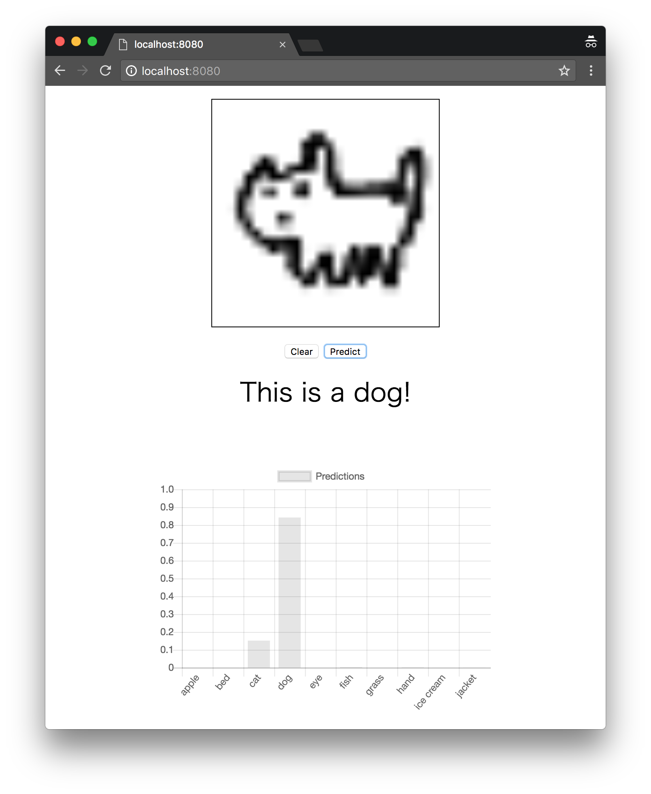

This repository is under experimental development.

# Doodle Image Recognition by MaruLabo

It is a classification model of doodle image. Classify from 28 pixel square grayscale images.
The learning data uses "[The Quick, Draw! Dataset](https://github.com/googlecreativelab/quickdraw-dataset)".

## Standard CNN model

Model binaries are included in the release.

The performance and architecture will be added here.

## How to use

soon

## Examples

### TensorFlow.js Web Application (Simple)

Run browser application to recognize doodle with [TensorFlow.js](https://js.tensorflow.org/).

This is the smallest example for PWA applications using javascript.

Details are [here](examples/tensorflow_js_simple).

### TensorFlow.js Web Application (via Vue.js)

Run browser application to recognize doodle with [TensorFlow.js](https://js.tensorflow.org/).

It is a full-fledged example using Vue which is a reactive MVC framework.

Details are [here](examples/tensorflow_js)

### TensorFlow Serving via minimal RESTful API Server

An example of building API server proxy to
[TensorFlow Serving](https://www.tensorflow.org/serving/)
Model Server and using it from the Web application.

Details are [here](examples/api_server_app)

## About Datasets

Data is not included in this repository.
The data setup program downloads "The Quick, Draw! Dataset".

It data made available by Google, Inc.
under the Creative Commons Attribution 4.0 International license.
https://creativecommons.org/licenses/by/4.0/

