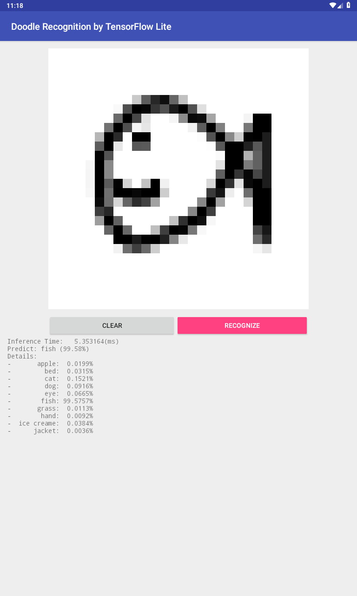

# Doodle Recognition by TensorFlow Lite (for Android)



# How to build

You must install [Bazel](https://bazel.build/),
Android SDK, and Android NDK.

You change Android SDK/NDK installation path in WORKSPACE file.

```
# Android SDK
android_sdk_repository(
  name='androidsdk',
  path='</abs/path/to/android/home>',
  #api_level = 28,
  #build_tools_version = '26.1.1',
)

# Android NDK
android_ndk_repository(
  name='androidndk',
  path='</abs/path/to/ndk>',
  api_level = 16, # The supported NDK versions with Bazel are currently 10 to 16.
)
```

Building the application:

```
$ # Using pre-built TFLite AAR.
$ # generated to `./bazel-bin/net.marulabo.doodle.apk`.
$ bazel build //:net.marulabo.doodle
```

If you want to build TFLite from source:

```
$ # generated to `./bazel-bin/net.marulabo.doodle.native.apk`.
$ bazel build //:net.marulabo.doodle.native
```

