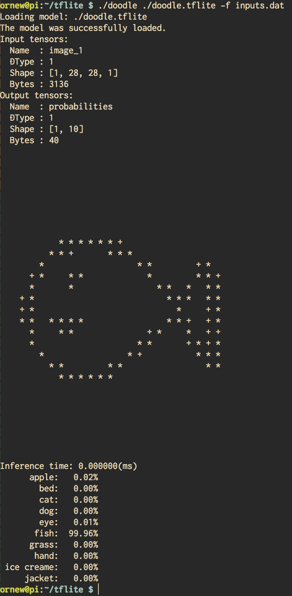

# Doodle for TensorFlow Lite on Raspberry Pi



This has been tested on Raspberry Pi 3 Model B Rev 1.2,
Raspbian GNU/Linux 9 (stretch),
gcc version 6.3.0 20170516 (Raspbian 6.3.0-18+rpi1+deb9u1)

## How to use

Predict data given from standard input or specified file data.

The input data is a grayscale image of 28x28 pixels.
Each pixel is represented by 0 to 255. Therefore, it is binary data of 784 bytes.

Positional Arguments:

- `tflite_model_path`: Path to model data(`.tflite`).

Optional Arguments:

- `-f`: The binary data file path for input data.

You can download the model data(`doodle.tflite`)
from [here](https://github.com/maru-labo/doodle/releases/download/v1.0.0/doodle.tflite).

If you use the example fish data(`./inputs.dat`):

```
$ ./doodle ./doodle.tflite -f ./inputs.dat
```

## How to build

You need to prepare `libtensorflow-lite.a`.
Refer to [here](https://github.com/tensorflow/tensorflow/blob/master/tensorflow/contrib/lite/g3doc/rpi.md).

Native compile example:

```
$ cd ~
$ git clone https://github.com/tensorflow/tensorflow.git
$ git clone https://github.com/google/flatbuffers.git
$ gcc-6 main.cpp \
>   -I$HOME/tensorflow \
>   -I$HOME/flatbuffers/include \
>   --std=c++11 \
>   -L. -ltensorflow-lite \
>   -lstdc++ -lpthread -ldl -lm
```

Convert SavedModel to TFLite Model:

```
$ python convert.py <path/to/doodle/saved_model/dir>
```

